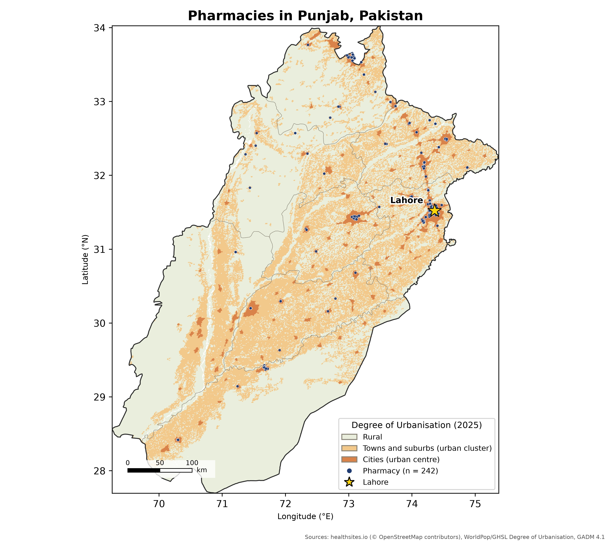
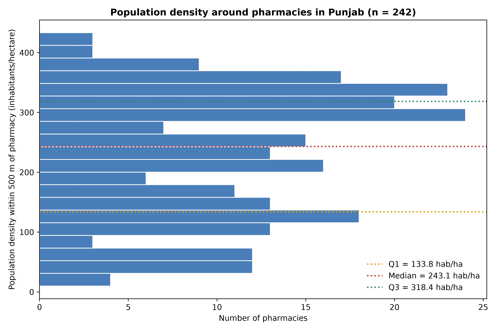
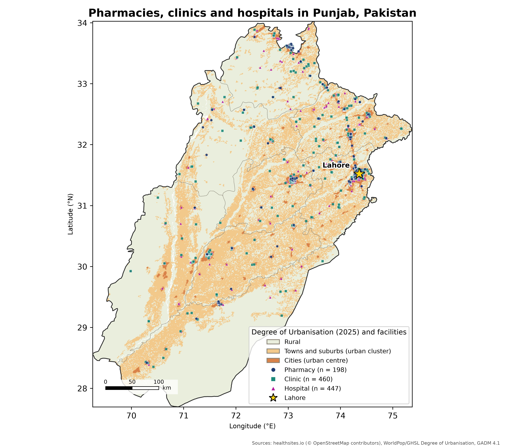
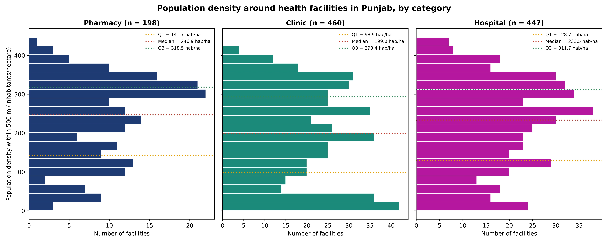

[](https://creativecommons.org/licenses/by/4.0/)

# Health facilities in Punjab (Pakistan): spatial distribution and surrounding population density

The workflow presented here consists of two Python notebooks that map health facilities in Punjab, estimate the population density (inhabitants per hectare) within 500 m of each one, and export figures and GeoPackages:

- `notebooks/pharmacies_punjab_density.ipynb`: focus on pharmacies only. All mapped pharmacy points are kept as they are (242 in Punjab).
- `notebooks/health_facilities_punjab_density.ipynb`: focus on pharmacies, clinics and hospitals, with density histograms separated by category. Nearby points are merged, so the pharmacy count is lower (198).

> **Why the pharmacy numbers differ between the notebooks.** Both notebooks select the same 242 pharmacy points in Punjab. Notebook 2 then merges pharmacy points closer than 50 m (27 merged groups, largest: 9 points), which gives 198 pharmacies, whereas notebook 1 does not merge points and reports the raw count. As a result, the pharmacy density values also differ slightly (median 243.1 in notebook 1 versus 246.9 in notebook 2).

## Output preview

### Notebook 1: pharmacies

<p align="center">
  
</p>

*Figure 1. Pharmacies in Punjab (n = 242, notebook 1) over the WorldPop/GHSL Degree of Urbanisation grid (2025). Star: Lahore. Sources: healthsites.io, WorldPop/GHSL, GADM 4.1.*

<p align="center">
  
</p>

*Figure 2. Population density within 500 m of each pharmacy (inhabitants/hectare), 20 bins. Dotted horizontal lines mark Q1, median and Q3.*

| File | Description |
|---|---|
| `data/output/map_pharmacies_punjab.jpeg` | Map of all pharmacies in Punjab over the Degree of Urbanisation layer (400 dpi) |
| `data/output/hist_density_pharmacies_punjab.jpeg` | Histogram (20 bins) of population density in the 500 m buffers, with dotted lines at Q1, median and Q3 (400 dpi) |
| `data/output/pharmacies_punjab_buffers.gpkg` | GeoPackage with layers `pharmacies` (points) and `buffers_500m` (polygons) |

### Notebook 2: pharmacies, clinics and hospitals

<p align="center">
  
</p>

*Figure 3. Pharmacies (n = 198), clinics (n = 460, including "other clinic") and hospitals (n = 447) in Punjab after the hospital name filter, reclassification and merging of nearby points (notebook 2).*

<p align="center">
  
</p>

*Figure 4. Population density within 500 m of each facility, by category (20 bins per panel, shared bin edges and density axis). Dotted horizontal lines mark Q1, median and Q3 of each category.*

| File | Description |
|---|---|
| `data/output/map_health_facilities_punjab.jpeg` | Map of the three facility types (circle = pharmacy, square = clinic, triangle = hospital) over the Degree of Urbanisation layer (400 dpi) |
| `data/output/hist_density_health_facilities_punjab.jpeg` | Three-panel histogram (20 bins per panel, shared bin edges and density axis), with dotted lines at Q1, median and Q3 for each category (400 dpi) |
| `data/output/facility_counts_by_step.csv` | Facility counts after each processing step (table below) |
| `data/output/health_facilities_punjab_buffers.gpkg` | GeoPackage with layers `facilities` (points, with `category`, `subtype` and `n_merged` fields) and `buffers_500m` (polygons) |

Intermediate files are in `data/temp/` (`pharmacies_punjab.gpkg`, `pharmacy_density.csv`, `health_facilities_punjab.gpkg`, `health_facility_density.csv`).

## Materials and methods

### Data sources

| Data | Source | File used |
|---|---|---|
| Health facilities | [healthsites.io](https://healthsites.io/) (OpenStreetMap extract, downloaded manually from the website) | `data/raw/health-sites-io/Pakistan-node.shp` (points, 4,265) and `Pakistan-way.shp` (building polygons, 689) |
| Population | [WorldPop](https://hub.worldpop.org/geodata/summary?id=74863), Pakistan 100 m, R2025A v1, constrained, 2025 | `pak_pop_2025_CN_100m_R2025A_v1.tif` (people per pixel, EPSG:4326, about 141 MB) |
| Degree of Urbanisation | [WorldPop / GHSL GHS-DUG](https://hub.worldpop.org/geodata/summary?id=125011), 2025, 1 km, Mollweide (ESRI:54009) | `PAK_DUG_2025_GRID_L1_R2025A_v1.tif` (classes: 1 rural, 2 towns and suburbs, 3 cities) |
| Administrative boundaries | [GADM 4.1](https://gadm.org/download_country.html), Pakistan | `gadm41_PAK.gpkg` (level 1 for Punjab, level 2 for districts) |

### Spatial definitions

1. **Boundary.** Punjab is selected from GADM level 1.
2. **Facility selection.** Healthsites records with `amenity` or `healthcare` equal to `pharmacy` (notebook 1, 874 in Pakistan: 834 points and 40 polygons) or to `pharmacy`, `clinic` or `hospital` (notebook 2). Polygons are converted to centroids. Duplicates are removed on OSM type + id, and sites are kept if they fall within the Punjab polygon (242 pharmacies; notebook 1 stops here, without merging). Each is assigned to a GADM district. Notebook 2 then applies the refinements described in the next section.
3. **Buffers.** A 500 m buffer is built around each facility in a metric CRS (WGS 84 / UTM 43N, EPSG:32643). Every buffer has an area of about 78.5 ha.
4. **Population.** WorldPop pixels whose centre falls inside a buffer are summed (windowed read per buffer).
5. **Density.** `density_hab_ha = population in buffer / buffer area (ha)`.
6. **Map background.** The Degree of Urbanisation grid is reprojected to WGS 84 (nearest neighbour) and clipped to Punjab.
7. **Plots and export.** Map and histogram are saved as JPEG at 400 dpi. Points and buffers, with their attributes, are written to the GeoPackage.

### Category definitions (notebook 2)

A site is a pharmacy, clinic or hospital if `amenity` or `healthcare` equals `pharmacy`, `clinic` or `hospital`. A site matching several categories would be counted once (priority hospital > clinic > pharmacy); none did in this extract. Tag counts, Pakistan-wide: 874 pharmacies, 920 clinics, 2,492 hospitals.

Because OSM hospital tags are applied loosely (labs, dental and herbal clinics, emergency services and other sites appear as hospitals) and one facility is often mapped several times, two refinements are applied:

1. **Hospital name filter.** Hospital-tagged sites are kept as hospitals only if their name matches `hospital` (plus the misspellings `hospitl` and `haspital`), the Urdu words `ہسپتال` / `اسپتال`, the Pashto word `روغتون`, or the acronyms THQ, DHQ or CMH (case-insensitive). The others (1,180 of 2,492 Pakistan-wide, including unnamed ones) are **reclassified as clinics** with `subtype = "other clinic"`; sites tagged as clinics keep `subtype = "clinic"`. The `category` field has three values (pharmacy, clinic, hospital), so "other clinic" sites are counted as clinics in the map and histograms, and `subtype` allows them to be told apart.
2. **Merging of nearby points.** Within each category, points closer than a threshold are merged (single linkage, in UTM 43N): **50 m for pharmacies and clinics, 250 m for hospitals**. The merged point is the mean location of the group and keeps the longest name. `n_merged` in the GeoPackage records how many points were merged, and a merged clinic group is an "other clinic" only if all its members are.

The keyword list and distances are set at the top of the notebook (`HOSPITAL_PATTERN`, `MERGE_DIST_M`).

## Results

### Facility counts after each step (see two-step category definitions above)

The notebook saves this table to `data/output/facility_counts_by_step.csv`.

| Step | Pharmacy | Clinic | Hospital | Total | of which "other clinic" |
|---|---|---|---|---|---|
| 1. Tagged in healthsites.io, all Pakistan | 874 | 920 | 2,492 | 4,286 | 0 |
| 2. Inside Punjab | 242 | 195 | 825 | 1,262 | 0 |
| 3. After hospital name filter (non-matching hospitals reclassified as other clinic) | 242 | 489 | 531 | 1,262 | 294 |
| 4. After merging nearby points (**final**) | **198** | **460** | **447** | **1,105** | 272 |

Step 3 moves 294 Punjab sites from hospital to clinic (1,180 Pakistan-wide). Step 4 merges 531 hospital points into 447 (67 merged groups, largest: 4 points), 242 pharmacy points into 198 (27 groups, largest: 9) and 489 clinic points into 460 (28 groups, largest: 3). The final 460 clinics are 188 clinics and 272 other clinics.

### Density

Density (inhabitants/ha) around the 242 pharmacies: Q1 = 133.8, median = 243.1, Q3 = 318.4 (min 9.8, max 433.3, mean 228.4). Lahore has the most pharmacies in the data (98), followed by Rawalpindi (37) and Gujranwala (35).

Density (inhabitants/ha) by category, notebook 2:

| Category | n | Q1 | Median | Q3 |
|---|---|---|---|---|
| Pharmacy | 198 | 141.7 | 246.9 | 318.5 |
| Clinic (incl. other clinic) | 460 | 98.9 | 199.0 | 293.4 |
| Hospital | 447 | 128.7 | 233.5 | 311.7 |

## Limitations

- **Coverage.** Healthsites data are crowd-sourced (OpenStreetMap-based). The 242 (or 198 after merging) pharmacies are very likely a small, spatially biased fraction of the real number in Punjab, concentrated in cities such as Lahore. Results describe the *mapped* pharmacies only.
- **Facility tagging.** Categories rely on OSM tags, which are applied inconsistently. The hospital name filter removes most mis-tagged sites but can miss hospitals with names that contain none of the keywords (e.g. "Punjab Medical Center") and keep a few non-hospitals whose name contains "hospital". Merging can join distinct facilities that are very close (50 m for pharmacies and clinics, 250 m for hospitals); in Punjab the largest merged group is 9 pharmacies, likely a pharmacy market. The "other clinic" group is heterogeneous (labs, dental and herbal practices, unnamed sites). Two buffers fall at the raster edge and contain fewer than 60 valid pixels.
- **Population layer.** WorldPop is a modelled estimate (100 m, 2025 population), not a census count.
- **Projection.** Punjab spans UTM zones 42 and 43. Using zone 43 for all buffers introduces a small scale distortion (well under 1%) at the western edge.
- **Histogram orientation.** Bars are horizontal (density on the y axis) so the horizontal dotted lines for Q1, median and Q3 sit on the density scale.

# Reproducing the code

## Data architecture

The notebooks work **locally only**: they read every input from `data/raw/` and do not download anything. If a file is missing, the first code cell stops with a message listing it. Download the data beforehand from the links above and place it as follows:

```
data/raw/
├── gadm41_PAK.gpkg                          GADM 4.1 Pakistan, GeoPackage (https://gadm.org/download_country.html)
├── pak_pop_2025_CN_100m_R2025A_v1.tif       WorldPop population counts, 100 m (hub.worldpop.org, id 74863)
├── PAK_DUG_2025_GRID_L1_R2025A_v1.tif       WorldPop / GHSL Degree of Urbanisation grid L1 (hub.worldpop.org, id 125011)
└── health-sites-io/
    ├── Pakistan-node.shp (+ .dbf, .shx, .prj, .cpg)
    └── Pakistan-way.shp  (+ .dbf, .shx, .prj, .cpg)   healthsites.io extract (https://healthsites.io/)
```

## How to

1. Put the raw data in `data/raw/` as described in [Data architecture](#data-architecture).
2. Create the environment and run the notebooks:

```bash
conda env create -f environment.yml
conda activate amr-degrassi
cd notebooks
jupyter nbconvert --to notebook --execute --inplace pharmacies_punjab_density.ipynb
jupyter nbconvert --to notebook --execute --inplace health_facilities_punjab_density.ipynb
```

or open either notebook in JupyterLab and run all cells. Without conda, `pip install -r requirements.txt` works too (a recent geopandas/rasterio with binary wheels is needed). The environment was tested from scratch on conda-forge (Python 3.12, geopandas 1.2, rasterio 1.5, shapely 2.1, pandas 3.0, matplotlib 3.11) and reproduces the numbers reported here exactly. Minimum versions: geopandas 1.0 and pandas 2.2 are required by the code (`union_all`, `groupby.apply(include_groups=...)`).

# Repository structure

```
environment.yml                                 conda environment (also requirements.txt for pip)
notebooks/pharmacies_punjab_density.ipynb        workflow, pharmacies only
notebooks/health_facilities_punjab_density.ipynb workflow, pharmacies + clinics + hospitals
data/raw/                                   source data (healthsites.io files in health-sites-io/)
data/temp/                                  intermediate files
data/output/                                figures and GeoPackage
```
